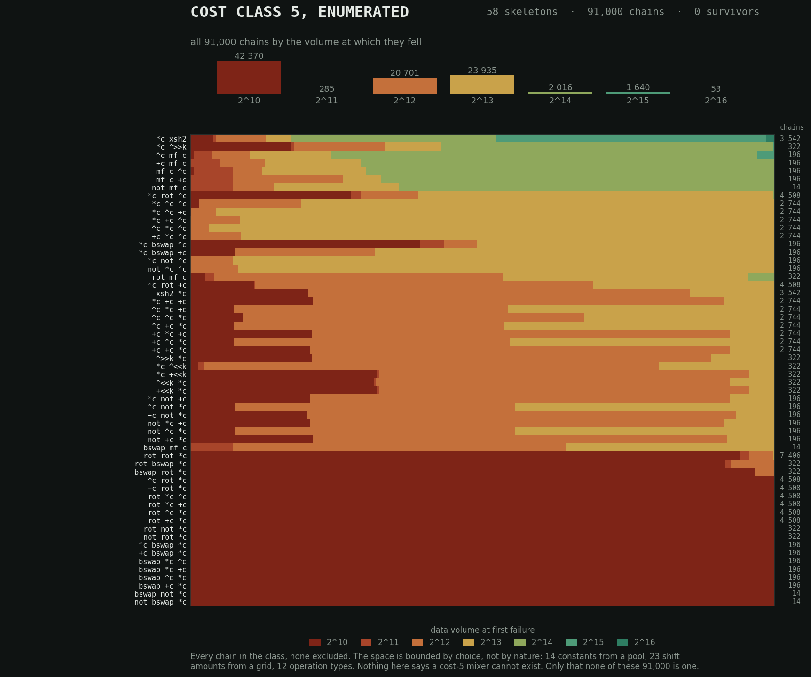

# The Ladder

> **Measuring instruments that do not question themselves lie.**

Most tests for 64-bit mixers stop telling them apart long before the
mixers stop differing. This one keeps going.

It feeds `mixer(ror64(T(counter) ^ C, r))` to PractRand and asks one
question: how much data does it take before the output can be told from
randomness? That volume is the score. Weak mixers give themselves away
after a few kilobytes; strong ones hold for terabytes. Nothing gets to
hide in the middle, because the scale does not run out the way an
avalanche score does, where almost everyone finishes near-perfect and
the ranking dies with the test.

What is here is one instrument and everything it has measured, including
the measurements that went against us. It is not a hash library, and
nothing in it is recommended for production use. The rig itself runs on
Windows for now — two anchors live in `.bat` helpers — while the mixers,
the header and every verdict file are platform-neutral; details under
[Reproducing](#reproducing). Porting it is a short job and nobody has
done it: every operating-system-specific line, what it would have to
become, and what has to pass before you may call it working, is written
out in [`rrc/PORTING.md`](rrc/PORTING.md).

**Where to go from here.** Run it: [Reproducing](#reproducing). What was
measured and how good the evidence is: [`results/README.md`](results/README.md).
How the rig works and what it has cost to learn: [`rrc/README.md`](rrc/README.md).
The bug that started the distrust: [`rrc/PRACTRAND_FINDING.md`](rrc/PRACTRAND_FINDING.md).

## The mixer that came out of it

```c
static inline uint64_t mulfold(uint64_t v, uint64_t c) {
    __uint128_t r = (__uint128_t)v * (__uint128_t)c;
    return (uint64_t)r ^ (uint64_t)(r >> 64);      /* low ^ high */
}

uint64_t meer10(uint64_t x) {                      /* cost 10 */
    x = mulfold(x, 0x5846dfed2f0e1d49);
    x ^= (x >> 28) ^ (x >> 6);
    return mulfold(x, 0x781f94b96e8edb3b);
}
```

Three lines, and the cheapest chain we know of that survives the full
RRC-64-40 diploma: 256 streams of one terabyte each, all 256 clean, no
`FAIL` in 256 terabytes.

**Read "cheapest we know of" narrowly**, because one row of the table
below is the reason to. The `wyhash` 8-byte path costs about the same
— roughly 10 by the same weights — and holds the gauntlet to 2^28. It
has never been taken further, not because it failed but because nobody
ran it that far. Depth costs days, and depth was spent on the chains
this project was chasing. So the honest claim is the smaller one:
meer10 is the cheapest chain that has *finished* the distance here.
Whether it is the cheapest that *could* is an open question with a
named candidate sitting next to it.

meer10 was never the goal. An instrument that only ever rejects has
proven nothing, so the ladder needed one mixer to carry its full
distance — a fall at 2^38 only means something if the scale above it is
not empty. That is this chain's job: the positive control of the
instrument. That it is also, so far, the cheapest chain measured over
that distance is the bonus, not the point. All 256 raw logs are in
[`results/diploma40_meer10_logs/`](results/diploma40_meer10_logs). The
header with both mixers, MSVC included, is [`meer10.h`](meer10.h);
[`verify_meer10.c`](verify_meer10.c) checks it against known answers
taken off the rig's own binary and, if you point it at a stream, against
the rig itself word for word.

**The weak spot in that run, stated here rather than three pages down.**
The diploma finished on 28 August 2026 and ran in segments; its earliest
surviving log opens on 22 August with 20 streams already booked, so it
began earlier still. It ran on the rig as it was then: two anchors, not
six. Its lower weight was mix13, which fell at 2^19 as it must. Its
*upper* weight was meer10 holding its own four gauntlet streams, which
is a pre-flight check and calibrates nothing: the candidate vouching for
itself. It is the same fallacy that cost mfx9 the anchor slot on 29
August 2026. The result is not weaker for being said out loud, but a
reader deserves to weigh it: `results/diploma40_meer10.log`.

`meer10(0)` is `0` — a fold does not move zero. If that matters where you
would use it, add a constant first, and know that you are then running a
mixer nobody here measured. It is not a cryptographic primitive: no key,
no adversary in the threat model, and nothing measured past 2^40 bytes
per stream.

---

## Why not just measure avalanche?

Because avalanche saturates. Practically every serious mixer scores
near-perfect, including the weak ones. One example from this rig: a
chain scoring **0.4998** (ideal: 0.5) failed the ladder at its very
first checkpoint, after 1–2 kilobytes. The quick test certified
perfection. The structure behind it was invisible to it by
construction: every output byte depended on just two input bytes.

A test where everyone gets an A does not rank anyone. The ladder does:

| Mixer | Cost | Dies on the ladder |
|---|---:|---|
| Stafford mix13 (splitmix64) | 12 | 2^16–2^21, all 32 streams of the entry test (full map: `anchor/`) |
| Murmur3 finalizer (fmix64) | 12 | 2^14–2^18, all 32 streams — matches Evensen's published range (`anchor/`) |
| Moremur (Evensen) | 12 | 16 of 32 disguises, from 2^16 |
| naked multiply-fold ×2 | 8 | 11 of 32 disguises |
| one folded AES round | ~5 | immediately, 1–2 KB (2^10) |
| `wyrand` mixing step¹ | 5 | 8–16 KB (2^13–2^14) — **as a counter finalizer, which is not its job**: native wyrand strides by a large odd constant, not +1 |
| xor-const + multiply-fold ×2 | 9 | 32/32 at 2 GB, 64/64 at 2^34 (`results/depth_lu9_*`) — **fails the diploma at 2^38** |
| `wyhash` 8-byte path¹ | ~10 | holds the gauntlet to 2^28 (deeper test pending) |
| NASAM (Evensen) | ~15 | passes RRC-64-42 per its author |

¹ Verbatim from
[wangyi-fudan/wyhash](https://github.com/wangyi-fudan/wyhash), bit-exact
against a second implementation of the same source in Python (`ladder.py
verify-wyhash`). Same author, different language and arithmetic: it
rules out a transcription or 128-bit error, not a misreading of the
original. Read the `wyrand` line carefully: it measures wyhash's *mixing
step used as a finalizer for counter inputs*. Native `wyrand` walks a
counter of stride `0x2d358dcc…`, not `+1`. This is a statement about the
mixing step under structured input, **not** a claim that wyrand is a
broken generator. Both verdicts in these two rows — the 2^13–2^14 death
and the gauntlet held to 2^28 — were measured on this rig, but their
stream logs are not among the published ones; they belong on the list of
unpublished runs at the top of [`results/README.md`](results/README.md).

The cost column is a weight table, not a clock — the full table, and
the one inconsistency it carries, are in [`rrc/README.md`](rrc/README.md).
On 31 August 2026 it was measured against a clock for the first time
(`rrc/bench_cost.cpp`, dependent chain, 100 M iterations, three runs),
and the clock disagrees twice: the table overprices the classical
shift-multiply mixers, and **meer10, at cost 10, runs slower than mix13,
fmix64 and moremur at cost 12** — 3.28 ns against 3.01–3.07 on the
measuring machine. What survives is the comparison the work rests on:
meer10 3.28 ns against NASAM 3.84, and NASAM is the mixer with a
comparable published reach. Full numbers: `results/cost_bench.json`.

---

## Method

**The streams.** A counter is the hardest realistic input: counters,
IDs and timestamps are exactly what finalizers see in production. To
stop a mixer from tuning itself to one stream shape, the counter comes
in **disguises**, from Pelle Evensen's RRC scheme: read backwards
(bit-reversal), inverted (complement), rotated by every amount. Four
transformations × rotations gives 32 to 256 streams depending on stage.

**The score is a minimum, and minima fall as you take more of them.**
A mixer's number is the smallest volume at which any of its streams gave
itself away, so a stage that runs more streams has more chances to find
the weak one and reports a smaller number. The stages run 1, 4, 32, 64
and 256 streams. Measured on this repository's own depth data, taking
the 23-member family and comparing the minimum over 64 streams against
the minimum over the 32 the entry test uses: the number moves by **2.5
doublings on average, 13 in the worst case, 0 for four of the 23**. So
figures from different stages are not interchangeable, and where this
repository compares mixers it compares them at the same stage. The
comparison table above is entry-test numbers throughout.

**The judge.** [PractRand](https://sourceforge.net/projects/pracrand/)
0.94 reads the mixed stream and reports the volume at which it can
demonstrate a difference from randomness. Only explicit `FAIL` verdicts
count; `suspicious` and `unusual` are expected at terabyte volumes and
are recorded, not acted on.

**0.94 is two releases old, deliberately.** The current release is 0.96
(December 2025), and it is what that link offers you. Every measurement
in this repository ran on 0.94, and swapping the judge mid-campaign
would not make the old numbers wrong — it would make them incomparable
to the new ones, which is worse, because nothing in the output shows
it. New work should use 0.96, and moving this rig there means re-running
the anchors first, since "the anchors hold" is a statement about a
particular judge. That is a debt, and it is written down as one in
[`rrc/PRACTRAND_FINDING.md`](rrc/PRACTRAND_FINDING.md).

**Machine-independent, judge-dependent.** The verdict depends only on
the byte stream, so anyone re-running a mixer through the same ladder
gets the same answer, and unlike a runtime benchmark there is no noise
to argue about. Two limits belong in the same breath. The verdict is
tied to this judge in this configuration: PractRand 0.94 with the return
patch, core test set, `-tf 2`, `-tlmin 1KB`. Another version or another
folding level is another measurement, and the mixers here were selected
against this one. And one verdict is not machine-independent at all:
`ABORTED` comes from a watchdog reading wall-clock behaviour, so a
loaded or slower machine can produce it where this one did not. That is
why an aborted stream is a hole rather than a result.

---

## The cascade — cheap kills first

Most candidates die in seconds; terabyte runs for all of them would be
waste. Each stage costs a multiple of the previous one, and only
survivors climb.

| Stage | Volume | Purpose |
|---|---|---|
| Gauntlet | 4 streams × 64–256 MB | the four historically deadliest disguises first |
| Smoke | 32 streams × 2 GB | the entry test: 4 transformations × 8 of the 64 rotations, none may fall |
| Depth | 64 streams × 16 GB (2^34) | separates real candidates from shallow ones |
| Diploma (RRC-64-40) | 256 streams × 1 TB | the test the literature respects; finalists only |

That the depth stage is not a ritual was shown by an entire enumerated
family: 23 chains that had passed the full 32-stream smoke test, and not
one of them survived 16 GB. Their 260 stream deaths run from 2^19 to
2^34, 237 of them at 2^31 or later. A shallow mixer looks exactly like a
deep one until the volume that separates them
(`results/depth_234_result.json`). **What the entry test does not see.**
Its 32 streams are four transformations against eight of the 64
rotations, so seven eighths of the rotation space never runs. That is
not a formality. In the depth data of the 23-member family, 23 stream
deaths land *below* 2 GB, the entry test's own volume, spread over 9 of
the 23 chains, and **every single one of them sits on a rotation the
entry test never runs.** Not one on a rotation it does. A chain can
therefore pass the entry test while a disguise it was never shown would
have killed it at a volume the entry test itself reaches. Counted from
`results/depth_234_result.json`.

**Passing a stage is a ticket to the next one, not a certificate.**

---

## Anchoring — why the rig can be believed

The most important property of a test rig is not that it measures, but
that it **can reject**. A test that never fails anything looks exactly
like a working test, only cheaper.

So nothing is measured until the rig has proved, in that same run, that
it is fit to judge. Six anchors, in three pairs. Each pair asks the
same question from both sides, because a check that has only ever been
seen to pass has not been seen to work:

| Anchor | What has to happen | What it proves | Cost |
|---|---|---|---|
| a mixer name that does not exist | comes back `NOT MEASURED` | it notices when nothing was measured | instant |
| a deliberate watchdog kill | comes back `ABORTED` | it notices when it stopped early | 3 s |
| a stream that writes 16 KB and freezes | is cut off as stalled | the stall detector bites | ~11 s |
| a healthy stream | survives the stall detector | and does not bite the living | 2 s |
| mix13 | **must fail** | the rig can convict | seconds |
| NASAM | **must hold** the gauntlets | and does not convict everyone | ~20 s |

**The weights** are last because they are the expensive pair, and they
are weights because somebody else weighed them first: Evensen reports
mix13 dying between 2^16 and 2^22, and NASAM passing RRC-64-42.
Agreeing with a mixer only this rig has ever measured would prove
nothing except that the rig agrees with yesterday's rig, which is why
our own mfx9 was taken out of that slot on 29 August 2026.
mfx9 had behaved impeccably in that slot, and behaving impeccably is
exactly what made the problem hard to see.

**The verdict pair**, rows one and two, costs four and a half seconds
and runs first, because anchors that ask *is the verdict correct*
quietly assume a verdict was reached at all. A mixer that has not fallen
after two kilobytes has broken no rule; a stream nobody measured looks,
in a results file, exactly like a stream that held. If the court cannot
say **I did not rule on this**, nothing it says afterwards is worth the
minutes.

**The stall pair** (rows three and four) is the youngest, and it is
here because of what half of it cost. For as long as the stall detector
existed, its only anchor was the patient: a healthy stream must
survive. It passed every time — and could only ever show that the
detector spares the living. When someone finally asked whether it ever
*bit*, the answer was no: it looked for a missing first checkpoint,
while the real stall freezes at 8 KB, four checkpoints in. Counted from
the finished cost-5 campaign: 1,409 of 92,091 streams paid two full
watchdog timeouts each for nothing — 1,337 stall aborts and 72
timeouts, and those logs are published as
[`k5_campaign.tar.gz`](https://github.com/0x44-Dante/The-Ladder/releases/tag/v1.0),
so the count is yours to check. Both directions, or neither.

If any of the six misbehaves, the run does not start.

That is the rule now, and "now" matters: the six became six on 30 August
2026. Every run passed the anchors the rig had at the time, and for the
older results in `results/` that was two. For the depth run of 19
August, one. Which result had which is set out in `results/README.md`,
file by file. The claim that holds without qualification is the narrower
one: no run in this repository ever proceeded past a failing anchor.

Where that rule comes from: PractRand 0.94 has a missing `return` that,
under `-O3`, ends the process silently after the first checkpoint —
every mixer looked `clean to 2^10`, including the worst.

**That bug is not our discovery, and it is fixed.** It was reported in
2019 (SourceForge bug #12, with a patch), the author confirmed the cause
in the project forum, and upstream removed it in pre0.95 by making the
function `void`. Checked on 1 September 2026: release 0.96 declares
`void show_checkpoint(...)` and has no such bug. What is ours is
narrower and is the reason this rule exists: under TDM-GCC 10.3 with
`-O3` the failure is not the segfault the bug reports describe but a
*silent exit with code 0* — no crash, no message, a log that looks like
a clean pass. Nothing in the output asks you to look twice. The full
account, with both hashes and both function signatures, is in
[`rrc/PRACTRAND_FINDING.md`](rrc/PRACTRAND_FINDING.md); the lesson is
that this rig proves its own rejection ability before every run instead
of assuming it.

And a stream that cannot be measured is never clean: if a feeder and its
PractRand hang, a watchdog kills it and marks it `ABORTED`, to be
re-run or reported as unresolved, never counted as a pass. An invented
number is worse than no number.

---

## Results so far

**A measured cost floor.** The systematic searches covered 9,062
structures in one run alone, plus 500 random constant variants of the
cheapest structure, plus a completed niche search (467 chains, 60
generations). Across all of them, **nothing below cost 9 passes the
smoke test**. The cheapest passer is the wyhash-style pattern: one
constant on the input, then two 128-bit multiply-folds.

**What is published under that heading, and what is not.** Cost class 5
is enumerated and its 91,000 verdicts are in `results/`. Classes 9 and
10 have named chains with full cascades behind them. For classes **6, 7
and 8 this repository publishes no chain verdict at all** — class 6 was
started on 30 August and stopped at 10,400 of 144,784 chains, which is a
fragment and is treated as one. The floor at nine is an upper bound from
below (nothing cheaper passed) plus a mechanism, not a swept range.

**Cost class 5, exhausted.** For one class below the floor the word
"searched" can be replaced by "enumerated". On 30 August 2026 every
chain of cost class 5 was measured: all 58 skeletons, all **91,000**
assignments, no cap and no sampling. 89,556 died at the 32 MB pre-gate
(a cheap single stream that runs before the gauntlet) and 1,444 at the
256 MB gauntlet itself. **Not one got past it**, and not one came back
undecided. Two and a half hours of measurement in the final segment —
the campaign ran in more than one, and no total was kept — and the file
is here: `results/class_k5_complete_evals.jsonl`. It is also the first
result in this repository to carry a full provenance block — clean tree,
named commit, all six anchor verdicts.



*One row per skeleton, one band per chain, coloured by the volume at which
PractRand first told the output from random; deepest at the top. The rows
are stretched to equal width, so the picture shows how a skeleton dies
rather than how many chains it has — the count is printed beside it.
Drawn by [`assets/k5_map.py`](assets/k5_map.py) straight from the run's
own eval file.*

*98.4 % of the colours rest on one undisguised stream each — the 32 MB
pre-gate — so the map and the two findings below are statements about
the cheapest stream, not about all 256 disguises.*

The solid red block across the bottom is the finding. **Fourteen
skeletons — 19,880 chains, a fifth of the class — die at 2^10, the very
first checkpoint, every single one of them, whatever constants they are
given.** They have one thing in common: after their last nonlinear step
nothing carries high bits back down. A plain multiply moves information
upward only (carries travel one way), so unless a shift-xor, a rotation
or a fold brings the top back to the bottom, the low bits keep the
counter's structure and PractRand's low-bit tests find it in a kilobyte.

Counted rather than eyeballed: of the 58 skeletons, 13 do have that
back-transport after their last nonlinear step, and **all 13 outlive
2^10 — no exceptions.** The rule only runs one way; 31 skeletons without
it also get past the first checkpoint, so back-transport is sufficient
here and not necessary. The nine skeletons that get a stream to 2^14 or
deeper are all of one kind or the other: six carry a multiply-fold, the
other three (`*c ^>>k`, `*c xsh2`, `*c rot ^c`) follow a plain multiply
with something that moves the high half down. The deepest, `*c xsh2` at
2^16, is the shape meer10 uses one cost class up.

**What "every chain" means, exactly.** All 58 skeletons, all 91,000
assignments — but the space they are drawn from is bounded by choice,
not by nature: 14 constants from a pool, 23 shift amounts from a grid,
12 operation types, and the weight table itself (a different weighting
draws a different class). meer10 itself lies *outside* that grid, so
the enumeration could never have found it. The claim that holds: **over
this pool and this grid, no cost-5 chain survives even the 256 MB
gauntlet.** "There is no cost-5 mixer" is not measured and not claimed.
The axes, the counter-weightings and the three build filters are set
out in [`results/README.md`](results/README.md).

**Why the +1 matters (mechanism).** Inputs with low multiplicative
weight (small counters, many trailing zeros) produce a thin 128-bit
product, and the fold has nothing to fold. That is why naked
fold-fold dies on counter streams with *any* constant (500 tested). One
cheap operation up front makes every input generic and closes the gap.

**Stress test 1 — hardware crypto.** A single AES-NI round folded
back to 64 bits (nominally cost ~5) dies at the *first* checkpoint. With
only half the 128-bit state filled, each output byte depends on two
input bytes after one round. Round-key parameters cancel out entirely
under the xor-fold (proven in `rrc/verify_aesenc.cpp`, alongside the
FIPS-197 known-answer test).

**Stress test 2 — an enumerated family.** Enumeration of cost-9 three-op
chains over a pool of established constants (a space of 30,980 chains in
three shape families) found **23 passers** of the form *fold → byteswap
→ fold*. That is a second construction on equal footing with the wyhash
pattern, and no stochastic search had ever turned it up. All 23 then
failed the depth stage, and **all 260 individual failures landed on
streams without complement** — the exact signature of the fold weakness.
The byteswap *hides* the weakness just long enough for the entry test;
the constant up front *removes* it. Full map in `family/`.

The run got through 1,309 of those 30,980 chains, all inside the first
family, before a cap stopped it — too many candidates had reached the
expensive 2 GB stage to leave them unexamined. Enough to prove the
shape exists; not enough to prove it is the only other one. Families B
and C were never started, and that remainder is open.

**Where cost 9 ends.** In the RRC-64-40 diploma the cheapest passer held
1 TB on ten streams and then **failed at 2^38 (256 GB)** on two
independent ones, in `FPF-14+6/16` on the lowest bits (p = 6.8e-19 and
3.0e-27). The finding is triple-anchored: NASAM holds 1 TB on those
very streams, mix13 falls at 2^19 there, and the sibling chain with
`+const` instead of `^const` falls at 2^39. The weakness lives in the
pattern, not in the constant. The honest summary: *cost 9 buys you the
entry test and 16 GB of depth. It does not buy a diploma.*

That splits the original question in two, and both halves now have a
number — the second one bought with a week of machine time:

| Question | Answer |
|---|---|
| What does passing the **smoke test** (2 GB) cost? | **9** — measured, holds against 500 constants, hardware AES, an enumerated family, and deployed wyhash code |
| What does passing the **diploma** (RRC-64-40) cost? | **at most 10** — `meer10` took 256 streams × 1 TB, finishing 28 August 2026: 256/256, no `FAIL`, 34 `suspicious` (recorded, never acted on). The cheapest chain known to us that holds the full distance; whether some *other* cost-9 chain could is open. Run segments and logs: `results/README.md` |

---

## Reproducing

You need Python 3, a C++ compiler with 128-bit integer support
(`__uint128_t` — GCC or Clang), an x86-64 machine, and PractRand 0.94
built yourself (not bundled here).

**Windows, for now.** Two of the six anchors run as `.bat` helpers and
clean up after themselves with `taskkill`, so neither the court nor any
measuring command currently starts elsewhere. Nothing about the method
is Windows-specific; the helpers simply have not been ported. What
would have to change, line by line, is in
[`rrc/PORTING.md`](rrc/PORTING.md) — written as a map for whoever does
it, not as a claim that it works. Redrawing the cost-5 map additionally
needs `matplotlib`.

**Versions.** Everything here was built and measured with Python 3.11.7,
g++ 10.3.0 on Windows 11, and PractRand 0.94 with the return patch
below. The PractRand version is part of the verdict, not a detail.
`requirements.txt` carries the pins, and they matter for one thing
only: the two images in `assets/` redraw to different bytes under a
different matplotlib or Pillow.

**Building PractRand** is five commands and one mandatory patch, and
the order matters: patch *before* compiling, because a build from the
unpatched source looks like it worked and is worthless (an `-O3` build
dies silently after the first checkpoint and every mixer looks clean).
The steps, the patch line and the two traps found the hard way are in
[`rrc/README.md`](rrc/README.md#building-practrand-094-tdm-gcc-learned-the-hard-way-2026-08-17).

The ladder finds `RNG_test` via `$PRACTRAND`, `$PRACTRAND_DIR`, a
one-line `rrc/practrand.txt`, the default build location, then `PATH` —
and fails loudly if none has it. A missing judge must never look like a
clean stream.

Then build the feeder and run a mixer through the ladder:

```
g++ -O3 -march=native -std=gnu++14 rrc/feeder.cpp -o rrc/feeder.exe
python rrc/ladder.py                        # six anchors, then 8 streams
python rrc/ladder.py smoke meer10 2GB       # 32-stream smoke test
python rrc/ladder.py smoke mfx9 2GB         # mfx9 is the cost-9 chain
                                           # the papers call lu9
```

How long they take, measured on 31 August 2026 on the machine in the
anchor table (Ryzen 7 5700X, 8 physical cores, 16 streams at once): the
bare run **113 s**, of which 38 s is the court and 75 s the eight
streams; the 32-stream smoke **160 s** for a mixer that survives all of
it. A mixer that dies early finishes sooner, since the volume, not the
clock, is what the ladder measures.

**Two numbers are calibrated to one machine.** Sixteen streams at once
and an eight-second stall floor were measured on 8 physical cores, and
they are starting points elsewhere, not constants: `RRC_PAR` and
`RRC_STALL_S` override both. You will know the floor is too low for your
machine because the run refuses to start — the PATIENT anchor measures
the longest gap a healthy stream leaves and stops if the margin is gone,
which is better than quietly recording live streams as stalled.

**Which commands anchor, and which do not.** The bare run and `trial`
hold the full court first, and so do the six measuring commands
(`diploma`, `depth`, `gauntlet`, `exhaust`, `cost`, `wyhash-depth`):
none of them starts if an anchor misbehaves. `smoke` deliberately does
not. It is the hand tool you reach for while working on a mixer, and it
issues no verdict this repository would publish.

Arbitrary chains run without recompiling, via the generic chain
interface: `chain=8:781f94b96e8edb3b,11:0,8:b853d68343f7525b` is
fold(c1) → bswap → fold(c2).

**Results say where they came from — from 30 August 2026 onwards.** A
verdict here depends only on the byte stream, so the numbers are
reproducible by construction. But that alone leaves a reader trusting
that the published data came from the published tool. So a result file
carries a `provenance` block: the command, the commit it ran from and
whether the working tree was dirty, the md5 of both binaries that
touched the stream, and what the anchors actually said, verdict by
verdict:

```json
"provenance": {
  "command": "cost", "tool": "ladder.py", "commit": "c4a3237",
  "dirty": false, "feeder": "feeder.exe", "feeder_md5": "f3d647a0…",
  "rng_test": "PractRand 0.94 (built -std=gnu++14, return patch)",
  "anchors": ["mix13 -> FAIL at 2^19", "…_T0C0r00 -> clean to 2^28", …]
}
```

**And seven of the eight blocks say `dirty: true`.** That flag means the
working tree differed from the named commit while the run was going: the
commit dates the run and identifies the code it came from, it does not
reproduce it. Six of the seven are the smoke evidence and the lu9 depth
run of 30 August, measured while this README was being edited around
them. The one clean block is the complete cost class 5. Weigh them
accordingly.

`mix13 -> FAIL at 2^19` is checkable against *The Calibration Weights*,
which sets this rig's range beside Evensen's independently published
one. An anchor that had drifted would be visible in the result rather
than summarised away by an "anchor ok" line in a console log nobody
kept.

---

## Bring your own mixer — the trial

This rig exists so a stranger can put a mixer in and get an honest
number out. Copy `rrc/mixer_user.example.h` to `rrc/mixer_user.h` and
put your function in it — it needs exactly this signature, nothing else:

```c
static inline uint64_t user_mix(uint64_t x) { /* your mixer */ return x; }
```

Then:

```
python rrc/ladder.py trial 2GB
```

Measured on 30 August 2026 with the bundled example mixer, which fails:
**80 s** end to end — compile, six anchors, 32 streams. A mixer that
survives takes longer, because the streams then run to the full 2 GB
instead of dying at 2^16; the 32-stream smoke above is what that costs.

The trial rebuilds the feeder with your mixer, and **before judging a
stranger, the court proves it can judge**: mix13 must fall, NASAM must
hold — if either anchor misbehaves, no verdict is issued. Then your
mixer runs the full 32-disguise smoke with a live board (columns climb
as your streams survive; a death turns its column red and leaves a
stump). Exit code 0 means every stream was measured *and* held; aborted
or unmeasured streams are reported as holes in the verdict, never as
passes.

`mixer_user.h` and `practrand.txt` are gitignored — your mixer and your
paths stay on your machine. The example file contains mix13 on purpose:
run it as-is and watch it die around 2^19, so you have seen the rig
reject something before you trust it with your own work.

Pipe bytes through native pipes or `cmd.exe`, never through
PowerShell 5.1 — it is not byte-transparent and will corrupt the stream.

---

## Attribution

This rig measures with other people's ideas and tools. In order of how
much this work leans on them:

- **Pelle Evensen** — the RRC test scheme (rotate/reverse/complement of
  counter streams) that this ladder is built on, plus NASAM, Moremur and
  rrmxmx. [mostlymangling.blogspot.com](https://mostlymangling.blogspot.com/)
- **Chris Doty-Humphrey** — PractRand, the judge in every run.
- **Jon Maiga** — systematic tabulation of mixer skeletons against
  PractRand depth (2020), the closest published relative to the cost
  floor measured here. [jonkagstrom.com](https://jonkagstrom.com/)
- **Martin Leitner-Ankerl** — twenty mixers measured over RRC streams
  against a cost axis, with a declared Pareto front (2020). That is the
  same pair of axes this work uses, and where `costlimit/` starts from;
  six of the eight papers lean on him. *The primary source is cited in
  those papers by author and year only. The URL is not recorded in this
  repository, and that is a gap, not a citation.*
- **Austin Appleby** (MurmurHash3/fmix64), **David Stafford**
  (splitmix64 variants), **Wang Yi** (wyhash), **Chris Wellons**
  (hash-prospector), **Remco Bloemen** (MulSwapHash, 2014) and
  **Phil Bagwell** (Scala's `byteswap64`) — reference points, constants,
  and prior art for constructions measured here.

Constants used in candidates are deliberately borrowed from established
mixers; growing constants from scratch against this ladder was tried and
failed (the ladder is a judge, not a sculptor).

Full prior-art review with primary-source quotes: `literature/LITERATURE.md`.

---

## What is not here

**The search engine.** The evolutionary search that proposes
candidates, the *Schmiede*, lives in a separate, private repository and
stays private. Every *verdict* in this repository is reproducible with
what is here: you do not need the generator to re-run a judgement, only
the chain, and every chain is published. A reduced *lite* version may
follow later.

That line has a cost, and it should be stated rather than left for a
reader to discover. Three numbers quoted above come from the search and
cannot be re-derived from anything published here: the 9,062 structures
of one sweep, the 500 constant variants of the cheapest structure, and
the 467-chain niche search. They are counts of work done, not verdicts,
and nothing in the findings rests on them alone — but they are ours
alone, and you are entitled to weigh them accordingly. Everything the
conclusions actually stand on is a chain plus the verdict the ladder
recorded for it, and both are in `results/`. Raw PractRand stream logs
are published for 3,870 of them: the 256 diploma streams of meer10, the
64 + 64 depth streams of meer10 and lu9 with their anchor streams, the
3,251 re-measured cost-5 streams, 192 smoke streams across six mixers,
30 null-run streams from sources whose randomness is not in dispute, and
the two on which lu9 broke at 2^38. Together 7.1 MB, because PractRand
writes a few kilobytes per stream. The earlier claim that the large runs
"come to hundreds of megabytes" was wrong: the whole 256 TB diploma
comes to 1.1 MB of logs.

**And the cost-5 campaign folder is published too, as a release asset.**
This page said until 1 September that it was too large. That was a
packaging problem described as a size problem: 92,091 individual files
do not belong in a git tree, because every clone would pay for them —
but the same files pack to 10.7 MB, which is smaller than the eight PDFs
here. They are attached to
[release v1.0](https://github.com/0x44-Dante/The-Ladder/releases/tag/v1.0)
as `k5_campaign.tar.gz`, SHA-256 `2929a63f…`, and they carry the
campaign's own `evals.jsonl` and `result.json` alongside the raw logs —
both byte-identical to the copies in this folder. Nothing in the
repository now rests on a number you cannot recount.

**One anchor the private rig has and this one does not.** The search
rig carries a check that asks whether the bytes actually flowed: is the
chain of checkpoints unbroken, did a stream counted as clean reach its
target depth, does the number of reported subtests grow monotonically
with the data. `ladder.py` has fragments of that: the target-depth test
runs in the diploma tally, the checkpoint test only as far as the stall
detector needs it, and nothing at all for the subtest counts. It is
listed here as an open gap, and nothing about it is finished.

**Recommendations.** Nothing measured here is proposed for production
use. The mixers that passed are candidates; the ones that failed are
documented so nobody has to rediscover them.

**Proof.** Searches explored the space; they did not exhaust it. Nor
did the cost-9 family enumeration: it covered about a quarter of one of
three shape families before a cap stopped it. The cost-5 enumeration
did finish, but only over the pool of constants and the shift grid
named above, and that bound is a choice, not a fact about cost 5. Where
a coverage figure exists it is stated next to the claim. "Not found in
thousands of structures" is not "does not exist".

---

## Papers

Eight write-ups, one PDF per folder. They are the argument; the
measurements they rest on are in `results/`, and every number in them
was re-counted against those files before release. Where a table can be
derived from the raw data it is, so that prose and evidence cannot
drift apart.

The scripts that typeset them are not published. They are 3,700 lines
of Python holding the prose as string literals, they say nothing the
PDFs do not, and a reader who wants to check a paper checks it against
`results/`, not against its typesetter. What that costs is worth being
plain about: you cannot rebuild these PDFs from this repository, and
the byte-for-byte reproducibility the builds do have is not something
you can verify here. If a paper is wrong, the fix is a new PDF and a
dated note, the same as for any other published document.

- `ladder/` — the instrument: method, cascade, anchoring, limits.
- `costlimit/` — the cost bounds: entry at 9, diploma at 10, the
  mechanism and its hardening tests.
- `family/` — *The Specious Family*: how 23 cost-9 chains passed the
  entry test and died at depth, and what the one extra cost point buys.
- `k9end/` — lu9 over the full diploma distance, and its crack at 2^38.
- `lu9/` — the datasheet of a mixer that fails.
- `meer10/` — the datasheet of one that does not: the cheapest chain
  known to us that passes RRC-64-40, including where it is weaker than
  the mixer it outperforms.
- `anchor/` — the calibration weights: mix13 and fmix64 measured on this
  rig, cross-checked against Evensen's published ranges. And the day
  this rig's own anchor deleted four of its own logs.
- `errata/` — every error with a scientific consequence, in one place:
  what was wrong, how it was found, what it cost, and which mechanism it
  became. The six anchors are this paper's conclusions.

---

MIT, in [`LICENSE`](LICENSE). What belongs to other people — PractRand,
the RRC scheme, the reference mixers and their constants, the cost-axis
prior art — is named in [`NOTICE`](NOTICE).

**0x44 Zero Systems** · [github.com/0x44-Dante](https://github.com/0x44-Dante)
